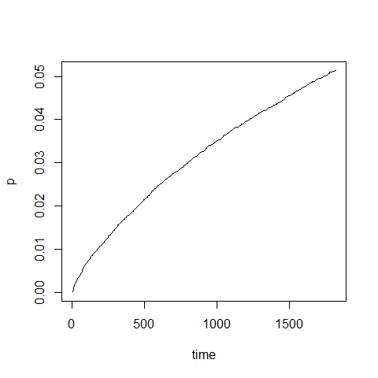

Development, internal-external validation, and use of a prognostic model
to predict future foot complications among people with diabetes recently
discharged from hospital in Ontario, Canada
================

- <a href="#overview" id="toc-overview">Overview</a>
- <a href="#set-up" id="toc-set-up">Set-up</a>
- <a href="#models" id="toc-models">Models</a>
  - <a href="#fine-gray-regression-fgr"
    id="toc-fine-gray-regression-fgr">Fine-Gray Regression (FGR)</a>
  - <a href="#random-survival-forest-for-competing-risks-rsfcr"
    id="toc-random-survival-forest-for-competing-risks-rsfcr">Random
    Survival Forest for Competing Risks (RSFCR)</a>
- <a href="#generating-predictions-on-new-data"
  id="toc-generating-predictions-on-new-data">Generating predictions on
  new data</a>
- <a href="#testing-model-performance"
  id="toc-testing-model-performance">Testing model performance</a>

## Overview

This file contains R code illustrating how to:

1.  Obtain all relevant model information (coefficients, hyperparameters
    etc.) from the model objects saved in this repository.
2.  Use the model objects to generate predictions on new test data.
3.  Assess model performance on the new test data.

## Set-up

To run the code below, please install and load the following R
libraries:

``` r
library(riskRegression)
library(randomForestSRC)
library(rms)
library(prodlim)
```

## Models

The final models (trained on the whole cohort reported in Roberst &
Loeffler et al.) are saved as .rds files in this repository and can be
loaded as follows:

``` r
## load model objects
FGR <- readRDS("models/final_FGR_clean.rds") # Fine-Gray Regression
# RSFCR <-
```

### Fine-Gray Regression (FGR)

The FGR model was optimized using `riskRgression::FGR()` (wrapper for
`cmprsk::crr()` to ensure compatibility with `riskRgression::Score()` -
see section below on obtaining model performance metrics). The FGR model
object contains all relevant items returned by `riskRegression::FGR()`,
including model coefficients (and bootstrapped SEs) as well as all knot
locations for continuous predictors, which were modeled with restricted
cubic splines using `rms::rcs()`:

``` r
names(FGR)
```

    ## [1] "crrFit"  "call"    "terms"   "form"    "cause"   "coef"    "splines"

``` r
# crrFit = model fit obtained with riskRegression::FGR()
# call = original model call (note: variance was set to FALSE, SEs of coefficients were obtained using bootstrapping)
# terms = model terms
# form = model formula
# cause = 1 (event of interest: 1 = foot complication)
# coef = optimized model coefficients (SEs) and corresponding subdistribution hazard ratios (sHR)
# splines = knot locations for restricted cubic splines for continuous predictors
```

### Random Survival Forest for Competing Risks (RSFCR)

…

## Generating predictions on new data

The model objects can be used to generate predicted risk scores on new
data (and subsequently evaluate model performance - see section below).

**For more information on relevant predictor variables and how they are
defined, please carefully review the data dictionary in
`data/data_dictionary.csv`.**
<details>
<summary>
Expand this section to review the data dictionary
</summary>

<div
style="border: 1px solid #ddd; padding: 0px; overflow-y: scroll; height:300px; overflow-x: scroll; width:100%; ">

<table class="table" style="font-size: 10px; width: auto !important; margin-left: auto; margin-right: auto;">
<thead>
<tr>
<th style="text-align:left;position: sticky; top:0; background-color: #FFFFFF;">
X
</th>
<th style="text-align:left;position: sticky; top:0; background-color: #FFFFFF;">
Variable
</th>
<th style="text-align:left;position: sticky; top:0; background-color: #FFFFFF;">
Variable.name.in.dummy.data
</th>
<th style="text-align:left;position: sticky; top:0; background-color: #FFFFFF;">
Variable.type
</th>
<th style="text-align:left;position: sticky; top:0; background-color: #FFFFFF;">
Range.categories
</th>
<th style="text-align:left;position: sticky; top:0; background-color: #FFFFFF;">
Definition
</th>
</tr>
</thead>
<tbody>
<tr>
<td style="text-align:left;">
Outcomes
</td>
<td style="text-align:left;">
Time
</td>
<td style="text-align:left;">
time
</td>
<td style="text-align:left;">
Numeric
</td>
<td style="text-align:left;">
Observed range: 0.1-2543.0
</td>
<td style="text-align:left;">
Time to event (in days)
</td>
</tr>
<tr>
<td style="text-align:left;">
</td>
<td style="text-align:left;">
Status
</td>
<td style="text-align:left;">
status
</td>
<td style="text-align:left;">
Categorical
</td>
<td style="text-align:left;">
0 = right-censored / 1 = foot complication / 2 = death
</td>
<td style="text-align:left;">
Observed status at follow-up time point
</td>
</tr>
<tr>
<td style="text-align:left;">
Predictors
</td>
<td style="text-align:left;">
Age
</td>
<td style="text-align:left;">
age
</td>
<td style="text-align:left;">
Numeric (integer)
</td>
<td style="text-align:left;">
18-105
</td>
<td style="text-align:left;">
Number of years between date of birth and hospital admission listed in
CIHI DAD
</td>
</tr>
<tr>
<td style="text-align:left;">
</td>
<td style="text-align:left;">
Sex
</td>
<td style="text-align:left;">
sex_f
</td>
<td style="text-align:left;">
Binary
</td>
<td style="text-align:left;">
Female/Not female
</td>
<td style="text-align:left;">
Biological sex of the patient as listed in CIHI DAD
</td>
</tr>
<tr>
<td style="text-align:left;">
</td>
<td style="text-align:left;">
Admission urgency
</td>
<td style="text-align:left;">
elective_adm
</td>
<td style="text-align:left;">
Binary
</td>
<td style="text-align:left;">
Elective/Not elective
</td>
<td style="text-align:left;">
Admission category listed in CIHI DAD. If admission is coded as category
‘L’, the hospitalization is considered to be elective/scheduled
</td>
</tr>
<tr>
<td style="text-align:left;">
</td>
<td style="text-align:left;">
Homelessness
</td>
<td style="text-align:left;">
homelessness
</td>
<td style="text-align:left;">
Binary
</td>
<td style="text-align:left;">
FALSE/ TRUE
</td>
<td style="text-align:left;">
Flag indicating whether patient experienced homelessness at the time of
admission based on presence of ICD-10-CA code Z59.0 or Z59.1
</td>
</tr>
<tr>
<td style="text-align:left;">
</td>
<td style="text-align:left;">
Peripheral artery disease
</td>
<td style="text-align:left;">
peripheral_AD
</td>
<td style="text-align:left;">
Binary
</td>
<td style="text-align:left;">
FALSE/TRUE
</td>
<td style="text-align:left;">
ICD-10-CA code for Atherosclerosis and arterial thrombosis of lower
extremities: I70.0, I70.2, I70.8, I70.9, I73.9, I74.0, I74.4, I74.5,
I74.8, I74.9, I79.2, or Angiopathy in diabetes: E10.50, E10.51, E10.70,
E10.71, E11.50, E11.51, E11.70, E11.71, E13.50, E13.51, E13.70, E13.71,
E14.50, E14.51, E14.70, E14.71
</td>
</tr>
<tr>
<td style="text-align:left;">
</td>
<td style="text-align:left;">
Coronary artery disease
</td>
<td style="text-align:left;">
coronary_AD
</td>
<td style="text-align:left;">
Binary
</td>
<td style="text-align:left;">
FALSE/TRUE
</td>
<td style="text-align:left;">
ICD-10-CA code I20, I21, I22, I23, I24, I25 or CCI code 1IJ50, 1IJ57,
1IJ76
</td>
</tr>
<tr>
<td style="text-align:left;">
</td>
<td style="text-align:left;">
Ischemic stroke or transient ischemic attack
</td>
<td style="text-align:left;">
stroke
</td>
<td style="text-align:left;">
Binary
</td>
<td style="text-align:left;">
FALSE/TRUE
</td>
<td style="text-align:left;">
ICD-10-CA code I63 (excluding I63.6), I64., H34.1, G45. (excluding
G45.0) or G45.4
</td>
</tr>
<tr>
<td style="text-align:left;">
</td>
<td style="text-align:left;">
Congestive heart failure
</td>
<td style="text-align:left;">
CHF
</td>
<td style="text-align:left;">
Binary
</td>
<td style="text-align:left;">
FALSE/TRUE
</td>
<td style="text-align:left;">
ICD-10-CA code I50
</td>
</tr>
<tr>
<td style="text-align:left;">
</td>
<td style="text-align:left;">
Hypertension
</td>
<td style="text-align:left;">
hypertension
</td>
<td style="text-align:left;">
Binary
</td>
<td style="text-align:left;">
FALSE/TRUE
</td>
<td style="text-align:left;">
ICD-10-CA codes I10, I11, I12, I13, I15
</td>
</tr>
<tr>
<td style="text-align:left;">
</td>
<td style="text-align:left;">
COPD
</td>
<td style="text-align:left;">
COPD
</td>
<td style="text-align:left;">
Binary
</td>
<td style="text-align:left;">
FALSE/TRUE
</td>
<td style="text-align:left;">
ICD-10-CA codes J41, J42, J43, J44
</td>
</tr>
<tr>
<td style="text-align:left;">
</td>
<td style="text-align:left;">
Chronic kidney disease
</td>
<td style="text-align:left;">
CKD
</td>
<td style="text-align:left;">
Binary
</td>
<td style="text-align:left;">
FALSE/TRUE
</td>
<td style="text-align:left;">
ICD-10-CA codes N032-N037, N052-N057, N18, N19, N250, Z490-Z492, Z940,
Z992
</td>
</tr>
<tr>
<td style="text-align:left;">
</td>
<td style="text-align:left;">
Malignancy
</td>
<td style="text-align:left;">
malignancy
</td>
<td style="text-align:left;">
Binary
</td>
<td style="text-align:left;">
FALSE/TRUE
</td>
<td style="text-align:left;">
ICD-10-CA codes C00-C97
</td>
</tr>
<tr>
<td style="text-align:left;">
</td>
<td style="text-align:left;">
Mental illness
</td>
<td style="text-align:left;">
mental_illness
</td>
<td style="text-align:left;">
Binary
</td>
<td style="text-align:left;">
FALSE/TRUE
</td>
<td style="text-align:left;">
ICD-10-CA codes for Mood or anxiety disorder (F30-F39, F40-48),
Schizophrenia, schizotypal and delusional disorders (F20-F29), or Mental
and behavioural disorders due to psychoactive substance use (F10-F19)
</td>
</tr>
<tr>
<td style="text-align:left;">
</td>
<td style="text-align:left;">
Hemoglobin A1C
</td>
<td style="text-align:left;">
Hb_A1C
</td>
<td style="text-align:left;">
Numeric (%)
</td>
<td style="text-align:left;">
Observed range: 1.2-21.7
</td>
<td style="text-align:left;">
LOINC code 3034639: Hemoglobin A1c \[Mass/volume\] in Blood; last result
value measured during admission
</td>
</tr>
<tr>
<td style="text-align:left;">
</td>
<td style="text-align:left;">
Creatinine
</td>
<td style="text-align:left;">
creatinine
</td>
<td style="text-align:left;">
Numeric (?mol/L)
</td>
<td style="text-align:left;">
Observed range: 1-2124
</td>
<td style="text-align:left;">
LOINC code 3020564: Creatinine \[Moles/volume\] in Serum or Plasma; last
result value measured during admission
</td>
</tr>
<tr>
<td style="text-align:left;">
</td>
<td style="text-align:left;">
Albumin
</td>
<td style="text-align:left;">
albumin
</td>
<td style="text-align:left;">
Numeric (g/L)
</td>
<td style="text-align:left;">
Observed range: 7-100
</td>
<td style="text-align:left;">
LOINC code 3024561: Albumin \[Mass/volume\] in Serum or Plasma; last
result value measured during admission
</td>
</tr>
<tr>
<td style="text-align:left;">
</td>
<td style="text-align:left;">
Hemoglobin A1C = missing
</td>
<td style="text-align:left;">
Hb_A1C_missing
</td>
<td style="text-align:left;">
Binary
</td>
<td style="text-align:left;">
FALSE/TRUE
</td>
<td style="text-align:left;">
Missing indicator for Hemoglobin A1C
</td>
</tr>
<tr>
<td style="text-align:left;">
</td>
<td style="text-align:left;">
Creatinine = missing
</td>
<td style="text-align:left;">
creatinine_missing
</td>
<td style="text-align:left;">
Binary
</td>
<td style="text-align:left;">
FALSE/TRUE
</td>
<td style="text-align:left;">
Missing indicator for creatinine
</td>
</tr>
<tr>
<td style="text-align:left;">
</td>
<td style="text-align:left;">
Albumin = missing
</td>
<td style="text-align:left;">
albumin_misssing
</td>
<td style="text-align:left;">
Binary
</td>
<td style="text-align:left;">
FALSE/TRUE
</td>
<td style="text-align:left;">
Missing indicator for albumin
</td>
</tr>
</tbody>
</table>

</div>

</details>

<br>

Let’s create some new data from a single (hypothetical) patient:

``` r
# create data for a single patient  
new_data <- data.frame(
  age = 67,
  sex_f = 1,
  elective_adm = 1,
  homelessness = 0,
  peripheral_AD = 0,
  coronary_AD = 1,
  stroke = 0,
  CHF = 0,
  hypertension = 1,
  COPD = 0,
  CKD = 0,
  malignancy = 0,
  mental_illness = 0,
  creatinine = 140.0,
  Hb_A1C = 8.5,
  albumin = 32.1,
  Hb_A1C_missing = 0,
  creatinine_missing = 0,
  albumin_missing = 0
)
```

Crucially, for the FGR model, we additionally need to derive the
non-linear components for each continuous predictor (age, hemoglobin
A1C, creatinine, and albumin). We can use the knot locations stored in
the `FGR` model object to achieve this:

``` r
## this is only relevant for the FGR model
# derive non-linear splines based on knot locations
age_splines <- rcs(new_data$age, FGR$splines$age_knots)
creatinine_splines <- rcs(new_data$creatinine, FGR$splines$creatinine_knots)
Hb_A1C_splines <- rcs(new_data$Hb_A1C, FGR$splines$hba1c_knots)
albumin_splines <- rcs(new_data$albumin, FGR$splines$albumin_knots)

# add non-linear components to new_data
new_data$age1 <- age_splines[, 2]
new_data$age2 <- age_splines[, 3]
new_data$creatinine1 <- creatinine_splines[, 2]
new_data$creatinine2 <- creatinine_splines[, 3]
new_data$Hb_A1C1 <- Hb_A1C_splines[, 2]
new_data$Hb_A1C2 <- Hb_A1C_splines[, 3]
new_data$albumin1 <- albumin_splines[, 2]
```

We can now predict the risk of this patient for developing foot
complications (cause = 1) within 1 year:

``` r
# predict risk of foot complication at 1 year
risk_1_year <- predict(FGR, newdata = new_data, times = 365.25)[1]
```

``` r
print(risk_1_year)
```

    ## [1] 0.0171758

Thus, our hypothetical patient has a risk of 1.72% of developing a
diabetic foot complication within 1 year.

We can also plot the cumulative incidence function (CIF) for this
patient as follows:

``` r
# to plot CIF, we need to extract predicted values at multiple time points
time <- seq(1, 365 * 5, 5) # predict up to 5 years in steps of 5 days
p <- predict(FGR, newdata = new_data, times = time)
```

``` r
plot(time, p, type = "l")
```

<!-- -->

## Testing model performance

You can also use the model objects to evaluate model performance in a
new cohort of patients (e.g., for external validation).

We’ll use some (randomly generated) dummy data here to illustrate how
you can obtain AUROC and calibration metrics reported in Roberts &
Loeffler et al. (in preparation):

``` r
# generate random dummy data that (sort of)
# load dummy data
```
