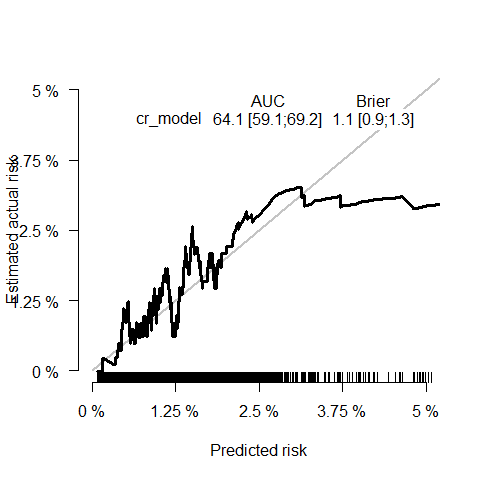
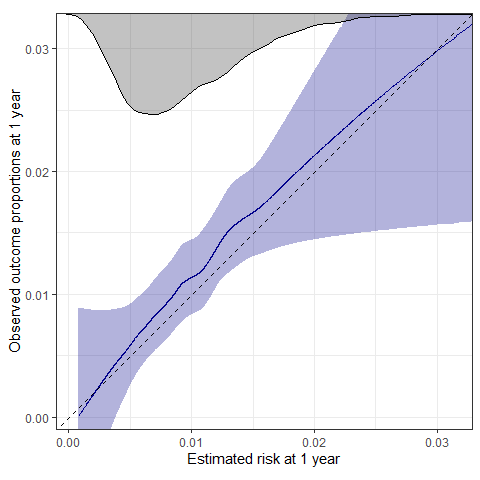

Development, internal-external validation, and use of a prognostic model
to predict future foot complications among people with diabetes recently
discharged from hospital in Ontario, Canada
================

- <a href="#overview" id="toc-overview">Overview</a>
- <a href="#set-up" id="toc-set-up">Set-up</a>
- <a href="#fine-gray-regression-fgr-model"
  id="toc-fine-gray-regression-fgr-model">Fine-Gray Regression (FGR)
  Model</a>
- <a href="#generating-predictions-on-new-data"
  id="toc-generating-predictions-on-new-data">Generating predictions on
  new data</a>
- <a href="#evaluating-model-performance"
  id="toc-evaluating-model-performance">Evaluating model performance</a>
  - <a href="#data-pre-processing" id="toc-data-pre-processing">Data
    pre-processing</a>
  - <a href="#performance-metrics" id="toc-performance-metrics">Performance
    metrics</a>
    - <a href="#auroc" id="toc-auroc">AUROC</a>
    - <a href="#calibration" id="toc-calibration">Calibration</a>

# Overview

This file contains R code illustrating how to:

1.  Obtain all relevant model information (coefficients, hyperparameters
    etc.) from the model object saved in this repository.
2.  Use the model objects to generate predictions on new test data.
3.  Assess model performance on the new test data.

# Set-up

To run the code below, please install and load the following R
libraries:

``` r
library(data.table)
library(dplyr)
library(geepack)
library(ggplot2)
library(prodlim)
library(riskRegression)
library(rms)
library(tableone)
```

# Fine-Gray Regression (FGR) Model

The final FGR model (trained on the whole cohort reported in Roberts &
Loeffler et al.) is saved as an .rds file in this repository and can be
loaded as follows:

``` r
model <- readRDS("model/final_FGR_clean.rds")
```

The model was optimized using `riskRgression::FGR()` (wrapper for
`cmprsk::crr()` to ensure compatibility with `riskRgression::Score()` -
see section below on obtaining model performance metrics). The FGR model
object contains all relevant items returned by `riskRegression::FGR()`,
including model coefficients (and bootstrapped SEs) as well as all knot
locations for continuous predictors, which were modeled with restricted
cubic splines using `rms::rcs()`:

``` r
names(model)
```

    ## [1] "crrFit"  "call"    "terms"   "form"    "cause"   "coef"    "splines"

``` r
# crrFit = model fit obtained with riskRegression::FGR()
# call = original model call (note: variance was set to FALSE, SEs of coefficients were obtained using bootstrapping)
# terms = model terms
# form = model formula
# cause = 1 (event of interest: 1 = foot complication)
# coef = optimized model coefficients (SEs) and corresponding subdistribution hazard ratios (sHR)
# splines = knot locations for restricted cubic splines for continuous predictors
```

# Generating predictions on new data

The model object can be used to generate predicted risk scores on new
data (and subsequently evaluate model performance - see section below).

**For more information on relevant predictor variables and how they are
defined, please carefully review the data dictionary in
`data/data_dictionary.csv`.**
<details>
<summary>
Expand this section to review the data dictionary
</summary>

#### Outcomes

| variable | colname | vartype     | range                                                  | definition                              |
|:---------|:--------|:------------|:-------------------------------------------------------|:----------------------------------------|
| Time     | time    | Numeric     | Observed range: 0.1-2543.0                             | Time to event (in days)                 |
| Status   | status  | Categorical | 0 = right-censored / 1 = foot complication / 2 = death | Observed status at follow-up time point |

#### Predictors

| variable                                     | colname            | vartype           | range                    | definition                                                                                                                                                                                                                                                                                                              |
|:---------------------------------------------|:-------------------|:------------------|:-------------------------|:------------------------------------------------------------------------------------------------------------------------------------------------------------------------------------------------------------------------------------------------------------------------------------------------------------------------|
| Age                                          | age                | Numeric (integer) | 18-105                   | Number of years between date of birth and hospital admission listed in CIHI DAD                                                                                                                                                                                                                                         |
| Sex                                          | sex_f              | Binary            | Female/Not female        | Biological sex of the patient as listed in CIHI DAD                                                                                                                                                                                                                                                                     |
| Admission urgency                            | elective_adm       | Binary            | Elective/Not elective    | Admission category listed in CIHI DAD. If admission is coded as category ‘L’, the hospitalization is considered to be elective/scheduled                                                                                                                                                                                |
| Homelessness                                 | homelessness       | Binary            | FALSE/ TRUE              | Flag indicating whether patient experienced homelessness at the time of admission based on presence of ICD-10-CA code Z59.0 or Z59.1                                                                                                                                                                                    |
| Peripheral artery disease                    | peripheral_AD      | Binary            | FALSE/TRUE               | ICD-10-CA code for Atherosclerosis and arterial thrombosis of lower extremities: I70.0, I70.2, I70.8, I70.9, I73.9, I74.0, I74.4, I74.5, I74.8, I74.9, I79.2, or Angiopathy in diabetes: E10.50, E10.51, E10.70, E10.71, E11.50, E11.51, E11.70, E11.71, E13.50, E13.51, E13.70, E13.71, E14.50, E14.51, E14.70, E14.71 |
| Coronary artery disease                      | coronary_AD        | Binary            | FALSE/TRUE               | ICD-10-CA code I20, I21, I22, I23, I24, I25 or CCI code 1IJ50, 1IJ57, 1IJ76                                                                                                                                                                                                                                             |
| Ischemic stroke or transient ischemic attack | stroke             | Binary            | FALSE/TRUE               | ICD-10-CA code I63 (excluding I63.6), I64., H34.1, G45. (excluding G45.0) or G45.4                                                                                                                                                                                                                                      |
| Congestive heart failure                     | CHF                | Binary            | FALSE/TRUE               | ICD-10-CA code I50                                                                                                                                                                                                                                                                                                      |
| Hypertension                                 | hypertension       | Binary            | FALSE/TRUE               | ICD-10-CA codes I10, I11, I12, I13, I15                                                                                                                                                                                                                                                                                 |
| COPD                                         | COPD               | Binary            | FALSE/TRUE               | ICD-10-CA codes J41, J42, J43, J44                                                                                                                                                                                                                                                                                      |
| Chronic kidney disease                       | CKD                | Binary            | FALSE/TRUE               | ICD-10-CA codes N032-N037, N052-N057, N18, N19, N250, Z490-Z492, Z940, Z992                                                                                                                                                                                                                                             |
| Malignancy                                   | malignancy         | Binary            | FALSE/TRUE               | ICD-10-CA codes C00-C97                                                                                                                                                                                                                                                                                                 |
| Mental illness                               | mental_illness     | Binary            | FALSE/TRUE               | ICD-10-CA codes for Mood or anxiety disorder (F30-F39, F40-48), Schizophrenia, schizotypal and delusional disorders (F20-F29), or Mental and behavioural disorders due to psychoactive substance use (F10-F19)                                                                                                          |
| Hemoglobin A1C                               | Hb_A1C             | Numeric (%)       | Observed range: 1.2-21.7 | LOINC code 3034639: Hemoglobin A1c \[Mass/volume\] in Blood; last result value measured during admission                                                                                                                                                                                                                |
| Creatinine                                   | creatinine         | Numeric (?mol/L)  | Observed range: 1-2124   | LOINC code 3020564: Creatinine \[Moles/volume\] in Serum or Plasma; last result value measured during admission                                                                                                                                                                                                         |
| Albumin                                      | albumin            | Numeric (g/L)     | Observed range: 7-100    | LOINC code 3024561: Albumin \[Mass/volume\] in Serum or Plasma; last result value measured during admission                                                                                                                                                                                                             |
| Hemoglobin A1C = missing                     | Hb_A1C_missing     | Binary            | FALSE/TRUE               | Missing indicator for Hemoglobin A1C                                                                                                                                                                                                                                                                                    |
| Creatinine = missing                         | creatinine_missing | Binary            | FALSE/TRUE               | Missing indicator for creatinine                                                                                                                                                                                                                                                                                        |
| Albumin = missing                            | albumin_misssing   | Binary            | FALSE/TRUE               | Missing indicator for albumin                                                                                                                                                                                                                                                                                           |

</details>

<br>

Let’s create some new data from a single (hypothetical) patient:

``` r
# create data for a single patient  
new_data <- data.frame(
  age = 67,
  sex_f = 1,
  elective_adm = 1,
  homelessness = 0,
  peripheral_AD = 0,
  coronary_AD = 1,
  stroke = 0,
  CHF = 0,
  hypertension = 1,
  COPD = 0,
  CKD = 0,
  malignancy = 0,
  mental_illness = 0,
  creatinine = 140.0,
  Hb_A1C = 8.5,
  albumin = 32.1,
  Hb_A1C_missing = 0,
  creatinine_missing = 0,
  albumin_missing = 0
)
```

Crucially, for the FGR model, continuous variables (age, hemoglobin A1C,
creatinine, and albumin) were modelled using restricted cubic splines.
which we additionally need to derive the non-linear components for each
continuous predictor . We can use the knot locations stored in the `FGR`
model object to achieve this:

``` r
## this is only relevant for the FGR model
# derive non-linear splines based on knot locations
age_splines <- rcs(new_data$age, model$splines$age_knots)
creatinine_splines <- rcs(new_data$creatinine, model$splines$creatinine_knots)
Hb_A1C_splines <- rcs(new_data$Hb_A1C, model$splines$hba1c_knots)
albumin_splines <- rcs(new_data$albumin, model$splines$albumin_knots)

# add non-linear components to new_data
new_data$age1 <- age_splines[, 2]
new_data$age2 <- age_splines[, 3]
new_data$creatinine1 <- creatinine_splines[, 2]
new_data$creatinine2 <- creatinine_splines[, 3]
new_data$Hb_A1C1 <- Hb_A1C_splines[, 2]
new_data$Hb_A1C2 <- Hb_A1C_splines[, 3]
new_data$albumin1 <- albumin_splines[, 2]
```

We can now predict the risk of this patient for developing foot
complications (cause = 1) within 1 year:

``` r
# predict risk of foot complication at 1 year
risk_1_year <- predict(model, newdata = new_data, times = 365.25)[1]
```

``` r
print(risk_1_year)
```

    ## [1] 0.0171758

Thus, our hypothetical patient has a risk of 1.72% of developing a
diabetic foot complication within 1 year.

We can also plot the cumulative incidence function (CIF) for this
patient as follows:

``` r
# to plot CIF, we need to extract predicted values at multiple time points
time <- seq(1, 365 * 5, 5) # predict up to 5 years in steps of 5 days
p <- predict(model, newdata = new_data, times = time)
```

``` r
plot(time, p, type = "l")
```

<!-- -->

# Evaluating model performance

If you want to evaluate model performance on a new dataset, we recommend
following the methods reported in [van Geloven et al.,
2022](https://www.bmj.com/content/377/bmj-2021-069249). Detailed code
examples can be found in the [survival-lumc
repository](https://github.com/survival-lumc/ValidationCompRisks). Here,
we just provide a brief summary of how to obtain AUROC and the
calibration plot/metrics reported in Roberts & Loeffler et al. (in
prep.)

We’ll use some (randomly generated) dummy data here to illustrate how
you can obtain AUROC and calibration metrics reported in Roberts &
Loeffler et al. (in preparation):

``` r
#dummy_data <- simulate_data(n = 10000, save_data = TRUE)
dummy_data <- readRDS("data/dummy_data.rds")
```

## Data pre-processing

The characteristics of our dummy cohort are similar to the cohort
reported by Roberts & Loeffler et al.:

<details>
<summary>
Show code
</summary>

``` r
tab1 <- CreateTableOne(vars = c("age",
                                "sex_f",
                                "elective_adm",
                                "peripheral_AD",
                                "coronary_AD",
                                "stroke",
                                "CHF",
                                "hypertension",
                                "COPD",
                                "CKD",
                                "malignancy",
                                "mental_illness",
                                "homelessness",
                                "Hb_A1C",
                                "creatinine",
                                "albumin"
), data = dummy_data)

tab1 <- print(
  tab1,
  nonnormal = c("age", "Hb_A1C", "creatinine", "albumin"),
  includeNA = TRUE,
  showAllLevels = FALSE,
  printToggle = FALSE
)
```

</details>

|                             | Overall                |
|:----------------------------|:-----------------------|
| n                           | 10000                  |
| age (median \[IQR\])        | 69.56 \[59.92, 79.92\] |
| sex_f = TRUE (%)            | 4950 (49.5)            |
| elective_adm = TRUE (%)     | 201 ( 2.0)             |
| peripheral_AD = TRUE (%)    | 101 ( 1.0)             |
| coronary_AD = TRUE (%)      | 1231 (12.3)            |
| stroke = TRUE (%)           | 490 ( 4.9)             |
| CHF = TRUE (%)              | 1293 (12.9)            |
| hypertension = TRUE (%)     | 4475 (44.8)            |
| COPD = TRUE (%)             | 570 ( 5.7)             |
| CKD = TRUE (%)              | 388 ( 3.9)             |
| malignancy = TRUE (%)       | 1098 (11.0)            |
| mental_illness = TRUE (%)   | 700 ( 7.0)             |
| homelessness = TRUE (%)     | 52 ( 0.5)              |
| Hb_A1C (median \[IQR\])     | 7.69 \[6.60, 8.93\]    |
| creatinine (median \[IQR\]) | 79.82 \[66.56, 93.13\] |
| albumin (median \[IQR\])    | 30.36 \[23.71, 36.85\] |

Note that the lab results (Hb A1c, creatinine, and albumin) have missing
values. To make sure we obtain valid model performance metrics, we use
the same imputation method that was used to develop and validate the
original model. Specifically, we create a new variable indicating
missingness of lab values, and then set the corresponding test results
to 0:

``` r
# create missing indicator flag
dummy_data[, Hb_A1C_missing := ifelse(is.na(Hb_A1C), TRUE, FALSE)]
dummy_data[, creatinine_missing := ifelse(is.na(creatinine), TRUE, FALSE)]
dummy_data[, albumin_missing := ifelse(is.na(albumin), TRUE, FALSE)]

# set missing test results to 0
dummy_data[is.na(Hb_A1C), Hb_A1C := 0]
dummy_data[is.na(creatinine), creatinine := 0]
dummy_data[is.na(albumin), albumin := 0]
```

Additionally, we again need to add the non-linear components. Here, we
are applying the same knot locations that were used in the validated
model:

``` r
# add non-linear components to new_data
age_splines <- rcs(dummy_data$age, model$splines$age_knots)
creatinine_splines <- rcs(dummy_data$creatinine, model$splines$creatinine_knots)
Hb_A1C_splines <- rcs(dummy_data$Hb_A1C, model$splines$hba1c_knots)
albumin_splines <- rcs(dummy_data$albumin, model$splines$albumin_knots)

dummy_data[, age1 := age_splines[, 2]]
dummy_data[, age2 := age_splines[, 3]]
dummy_data[, creatinine1 := creatinine_splines[, 2]]
dummy_data[, creatinine2 := creatinine_splines[, 3]]
dummy_data[, Hb_A1C1 := Hb_A1C_splines[, 2]]
dummy_data[, Hb_A1C2 := Hb_A1C_splines[, 3]]
dummy_data[, albumin1 := albumin_splines[, 2]]
```

## Performance metrics

To obtain model performance metrics, we can use the
`riskRegression::Score()` function:

``` r
t <- 365.25 # performance at 1 year

score_result <- Score(
  list(cr_model = model),
  data = dummy_data,
  formula = Hist(time, status) ~ 1,
  cause = 1,
  times = t,
  metrics = c("auc"),
  summary = c("risks", "ipa"),
  plots = c("ROC", "calibration"),
  conf.int = TRUE
)
```

### AUROC

To plot AUROC at 1 year, we can run `plotROC()` on the output returned
by `Score()`:

``` r
plotROC(score_result,
        times = 365.25,
        ylab = paste0("Sensitivity at 1 year"),
        xlab = paste0("1-Specificity at 1 year")
)
```

<!-- -->

### Calibration

Similarly, we can create a calibration plot based on the output of
`Score()` by running `plotCalibration()`:

``` r
# calibration plot
plotCalibration(
  score_result,
  method = "nne", # default
  cens.method = "jackknife",
  round = FALSE,
  xlim = c(0, 0.05),
  ylim = c(0, 0.05),
  rug = TRUE
)
```

<!-- -->

Note that `plotCalibration()` does not provide an option for loess
smoothing of the calibration curves. However, we can easily create
loess-smoothed curves with additional customization based on the data
returned by `Score()`:

``` r
obs <- score_result$Calibration$plotframe[times == t]$pseudovalue
pred <- score_result$Calibration$plotframe[times == t]$risk

# for plotting purposes, only include predicted scores within 99th percentile to ignore extreme/rare scores
lim <- quantile(pred, 0.99)

# get density of predicted values
d <- density(pred)
d_scaled <- lim - (d$y / max(d$y) * (lim / 4))
density_data <- data.frame(x = d$x, y = d_scaled)

# Use loess smoothing
smooth_pseudos <- predict(
  stats::loess(obs ~ pred, degree = 1, span = 2/3),
  se = TRUE
)

CI_lower <- smooth_pseudos$fit - qt(0.975, smooth_pseudos$df) * smooth_pseudos$se
CI_upper <- smooth_pseudos$fit + qt(0.975, smooth_pseudos$df) * smooth_pseudos$se 

fig <- ggplot() +
  geom_ribbon(aes(x = pred, y = obs, ymin = CI_lower, ymax = CI_upper), alpha = 0.3, fill = "darkblue") + 
  geom_line(aes(x = pred, y = smooth_pseudos$fit), color = "darkblue") +
  geom_abline(slope = 1, intercept = 0, color = "black", linetype = 2) +
  geom_ribbon(data = density_data, aes(x = x, ymin = y, ymax = lim), alpha = 0.3) + 
  geom_line(data = density_data, aes(x = x, y = y)) +
  scale_x_continuous("Estimated risk at 1 year", expand = c(0, 0)) +
  scale_y_continuous(paste0("Observed outcome proportions at 1 year"), expand = c(0, 0)) +
  coord_cartesian(xlim = c(-0.001, lim), ylim = c(-0.001, lim)) +
  theme_bw() +
  theme(aspect.ratio = 1)

print(fig)
```

<!-- -->

#### Calibration metrics

In addition to the calibration plot, we can evaluate calibration by
calculating the calibration slope & intercept, integrated calibration
index (ICI), and E50/E90 (50th/90th percentile of the absolute
prediction error). The following code was adapted from the
[survival-lumc
repository](https://github.com/survival-lumc/ValidationCompRisks) (also
see [van Geloven et al.,
2022](https://www.bmj.com/content/377/bmj-2021-069249)).

**Calibration slope**

To fit a model for the calibration intercept, we use a complementary
log-log transformation of the predicted risk estimates and use
generalized estimating equations (GEE) to obtain robust standard errors
via jackknife resampling (used for pseudovalue estimation):

``` r
# prepare data
data <- data.table(
  pred = pred,
  obs = obs,
  pred_cll = log(-log(1 - pred)) # get cloglog predicted risk
)

# Fit model for calibration slope
fit_cal_slope <- geese(
  obs ~ offset(pred_cll) + pred_cll,
  data = data,
  id = 1:nrow(data),
  scale.fix = TRUE,
  family = gaussian,
  mean.link = "cloglog",
  corstr = "independence",
  jack = TRUE
)

# get model summary
cal_slope <- summary(fit_cal_slope)$mean

# combine all
calibration_slope <- data.table(
  slope = 1 + cal_slope["pred_cll", ]$estimate,
  slope_SE = cal_slope["pred_cll", ]$san.se,
  slope_CI_lower = 1 + cal_slope["pred_cll", ]$estimate - qnorm(0.975) * cal_slope["pred_cll", ]$san.se,
  slope_CI_upper = 1 + cal_slope["pred_cll", ]$estimate + qnorm(0.975) * cal_slope["pred_cll", ]$san.se
)

print(calibration_slope)
```

    ##        slope  slope_SE slope_CI_lower slope_CI_upper
    ## 1: 0.7231788 0.1783837      0.3735532       1.072804

**Calibration intercept**

To get the calibration intercept, we use the same model as above, but
fix the slope to 1. This will tell us to what extend the model generally
over-/underestimates risk scores:

``` r
# fit model for calibration intercept
fit_cal_int <- geese(
  obs ~ offset(pred_cll),
  data = data,
  id = 1:nrow(data),
  scale.fix = TRUE,
  family = gaussian,
  mean.link = "cloglog", # link function for the means: complementary log-log transformation
  corstr = "independence",
  jack = TRUE # SE's are estimated using jackknife resampling method
)

# get model summary
cal_int <- summary(fit_cal_int)$mean


# combine all
calibration_intercept <- data.table(
  intercept = cal_int$estimate,
  intercept_se = cal_int$san.se,
  intercept_CI_lower = cal_int$estimate - qnorm(0.975) * cal_int$san.se,
  intercept_CI_upper = cal_int$estimate + qnorm(0.975) * cal_int$san.se
)

print(calibration_intercept)
```

    ##      intercept intercept_se intercept_CI_lower intercept_CI_upper
    ## 1: 0.003069739    0.1211431         -0.2343663          0.2405058


**ICI and E50/90**

Finally, we calculate ICI and E50/E90 to obtain summary metrics of the
difference between predicted vs. observed risk scores:

``` r
# get absolute prediction error
abs_pred_error <- abs(obs - pred)

ICI <- mean(abs(abs_pred_error))
E50 <- quantile(abs(abs_pred_error), c(0.5))
E90 <- quantile(abs(abs_pred_error), c(0.9))
```

    ## [1] "ICI =  0.021"

    ## [1] "E50 =  0.009"

    ## [1] "E90 =  0.018"
